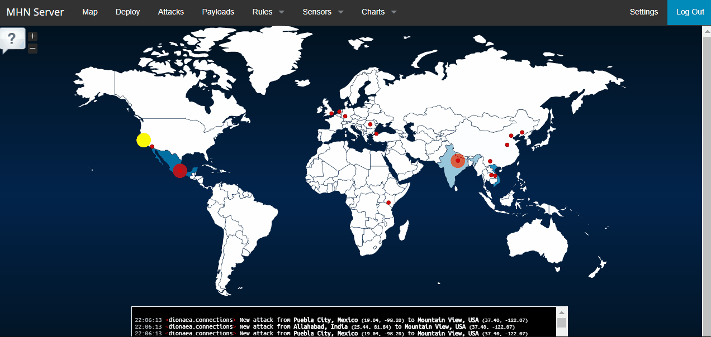
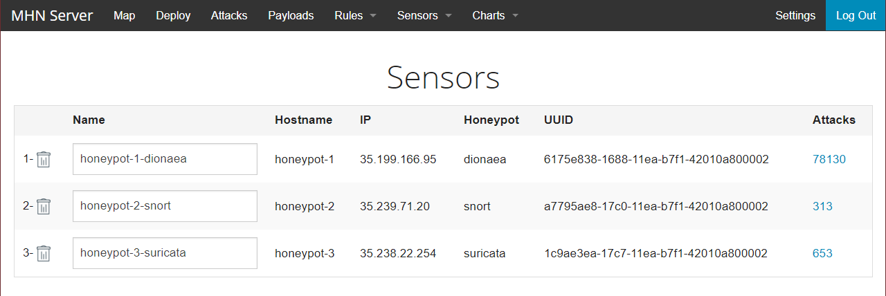
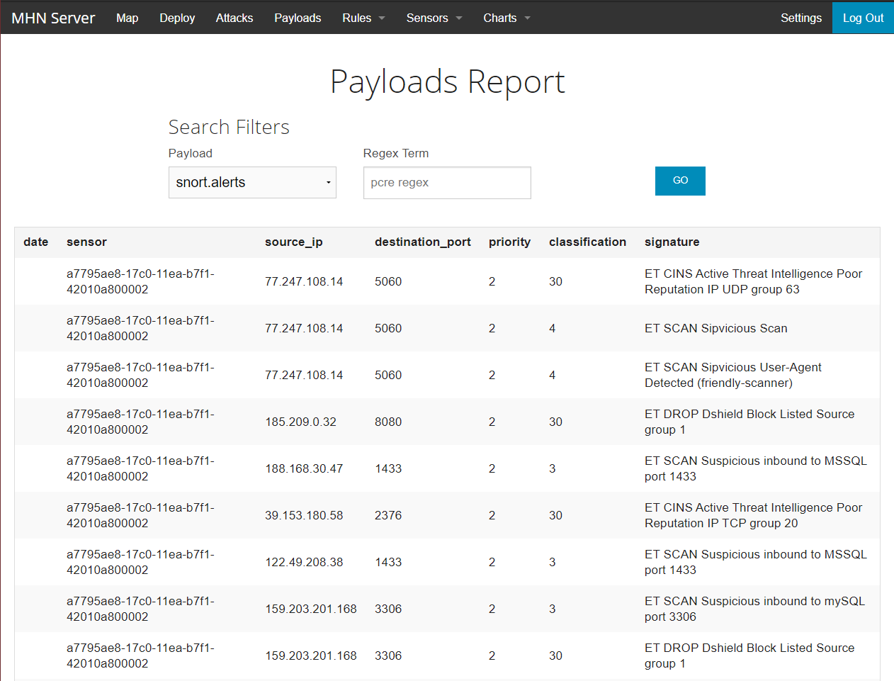

# w10-11_codepath_honeypot_project

## Setting up a honepot and intercepting attempted attacks using Modern Honey Network.

## Objective
From the codepath page:

> In this assignment, you will stand up a basic honeypot and demonstrate its effectiveness at detecting and/or collecting data about an attack. 

Codepath gave instructions on how to set-up and deploy a honeypot. the same instructions also work to deploy more honeypots of my choice. 

### Honeypots Deployed

* Dionaea
* snort
* suricata

### hours spent:
  About 10 hrs

<b><h3>Issues Encountered</h3></b>
* Though the instructions were easy to follow, I coiuld not get the MHN server to show all of the country icons. Could be that I missed a command. Deploying a honeypot was not a problem whatsoever, and setting up the other two was straight forward.

* Downloading the .json file was a bit complicated, not sure if it was becasue I'm using Windows for this project, or I was running the commands from the worng instance. I needed more instructions and how to troubleshoot some errors.  

# Summary

The number of attacks to the honeypots deployed as of 12/04/19 are as follows

### Payloads 

Notes

I was never sure of the mistakes I made in the setup process, as well as how to download the .json file.

Downloaded the file by other means that include tranfering the file to bucket within google cloud.

For the malwares samples, I figured that is probaly the payloads page. The Suricata honeypot is the on that collected the most samples. followeb by snort.

The attacks came mostly from Vietnam, Mexico and Indonesia.

view my  [session.json](https://github.com/jacobfccrs/w10-11_codepath_honeypot_project/blob/master/session.json ".json file") for more details.
